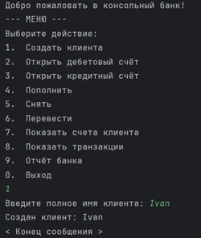
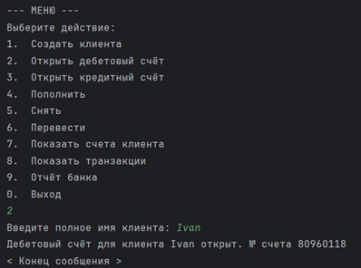
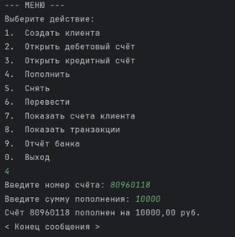

# ConsoleBanking
Educational project - implementation of Console Banking app with Java

Консольное приложение, моделирующее базовые операции банковской системы: создание клиентов, открытие счетов, проведение транзакций и генерация отчётов.

<div>
  
  
  
</div>  

## Описание

Проект демонстрирует принципы объектно-ориентированного программирования (инкапсуляция, наследование, полиморфизм) и включает:
- Управление клиентами и банковскими счетами
- Поддержку двух типов счетов: **дебетовых** и **кредитных**
- Ведение истории всех транзакций
- Генерацию отчётов по активности банка

Приложение полностью консольное и управляется через текстовое меню.

---

## Основные возможности

- Создание клиентов
- Открытие дебетовых и кредитных счетов
- Пополнение, снятие и перевод средств
- Просмотр счетов конкретного клиента
- Просмотр полной истории транзакций
- Генерация сводного отчёта банка:
    - Количество счетов по типам
    - Суммарные балансы
    - Статистика успешных и неуспешных операций

---

## Структура проекта  
src/  
├── Main.java    
├── Account/  
│ ├── Account.java  
│ ├── CreditAccount.java  
│ └── DebitAccount.java  
│  
├── Bank/  
│ └── Bank.java  
│  
├── Customer/  
│ └── Customer.java  
│
├── Interaction/  
│ └── Interaction.java  
│
├── Transaction/  
│ ├── Transaction.java  
│ ├── TransactionService.java  
│ ├── OperationResult.java  
│ └── Type.java  
│  
└── Utils/  
    ├── BankNumberGenerator.java  
    ├── IDGenerator.java  
    ├── MathRandomGenerator.java  
    └── SequentialIDGenerator.java  

---

## Запуск

1. В консоли:
   ```bash
   javac -d out src/**/*.java
   java -cp out Main
    ```  
2. В IDE - запустить Main.java как точку входа.

---

### Автор: Anton Evgenev. tg: @tdutanton